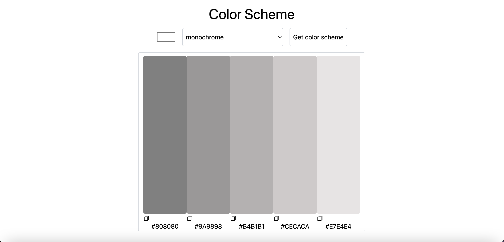

# Color Scheme Generator

カラーパレットを作成する配色ジェネレーターです。

## デモ

[Color Scheme Generator](https://hyuga-colorschemegenerator.netlify.app/)

## 使い方

1. 好きな色を1色選びます
2. テーマを選択します
3. "Get color scheme"を押します
4. 5色、配色されます

## 経緯

- [Scrimba](https://scrimba.com/scrim/co73343ea8c93c5d396d7ac67)の Solo Project の 1 つだったため
- API の使い方を深めるため（[The Color API](https://www.thecolorapi.com/)を使いました）

## 今後やりたいこと

- 自分で色を選ぶだけでなく、画像から色を検出させて、カラーパレットを作成するようにさせたい
- 作成されたカラーパレットを一時的に保存できるようにしたい
